# chumthesizer

> A tactile, OP‑1‑inspired **groovebox** you play with three real devices: an **Apple Magic Trackpad 2**
> as a multi‑instrument surface, an **Ulanzi D100H dial** that warps the sound, and an **Elgato Stream
> Deck Pedal** for hands‑free looping. **Fifteen voices**, a robust **8‑track looper**, a reactive
> OP‑1‑style screen — and a shark that cruises the trackpad. Pure **Web Audio**, no plugins; runs in a
> browser tab or as a desktop app.

<p align="center">
  <a href="https://brendanwelsh.github.io/chumthesizer/"><b>▶&nbsp;Play it live</b></a>
  &nbsp;·&nbsp; <a href="https://brendanwelsh.github.io/chumthesizer/about.html">Project page</a>
  &nbsp;·&nbsp; <a href="BUILD.md">Build&nbsp;&amp;&nbsp;play</a>
  &nbsp;·&nbsp; <a href="KEYBINDS.md">Key&nbsp;map</a>
  &nbsp;·&nbsp; <a href="DESIGN.md">Design&nbsp;notes</a>
  <br><sub>The hosted version is fully playable with <b>mouse · keyboard · touch</b> — no hardware or install. (The three devices need their local helpers; see Build &amp; play.)</sub>
</p>

<p align="center">
  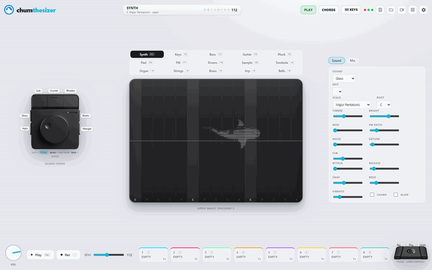
</p>

<p align="center"><sub>Live: building a full <b>8‑track loop</b> — spin the dial (an endless encoder, no stop), press its keys to swap sounds, <b>chord mode</b>, then the whole rack in grid view.</sub></p>

<p align="center">
  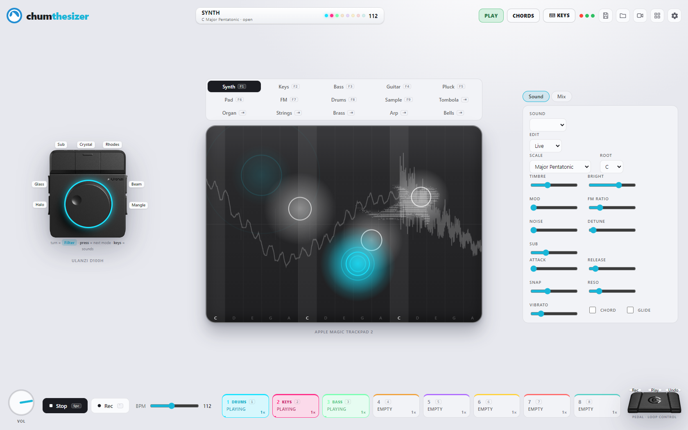
</p>

<p align="center"><sub>The <b>Magic Trackpad</b> is the instrument · the <b>D100H dial</b> warps it · the <b>Stream Deck Pedal</b> drives the loop tape. Fully playable right now with just a mouse &amp; keyboard.</sub></p>

---

## A whole rack on one surface

The one trackpad becomes a different instrument the instant you switch. Each draws its own faint guide
on the surface, plays the shared synth engine its own way, and records into any loop.

<table>
  <tr>
    <td width="50%" align="center">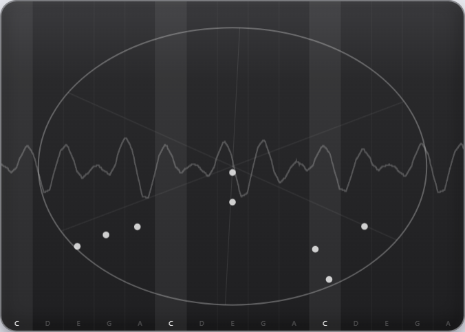<br><b>Tombola</b> — drop bouncing note‑balls into a spinning arena; every wall hit plucks a note</td>
    <td width="50%" align="center">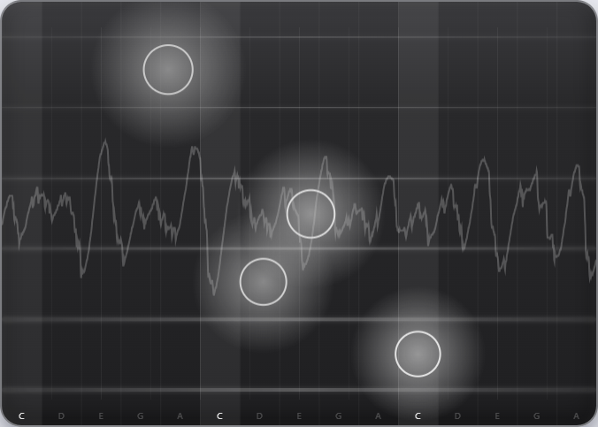<br><b>Guitar</b> — six pluckable strings, fret across, strum down</td>
  </tr>
  <tr>
    <td width="50%" align="center">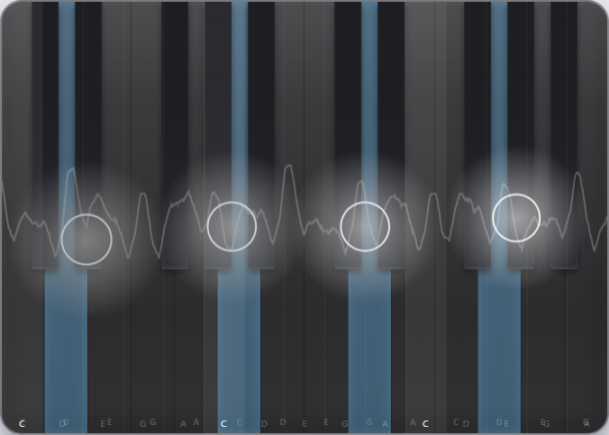<br><b>Keys</b> — a real piano keyboard; held notes light up</td>
    <td width="50%" align="center">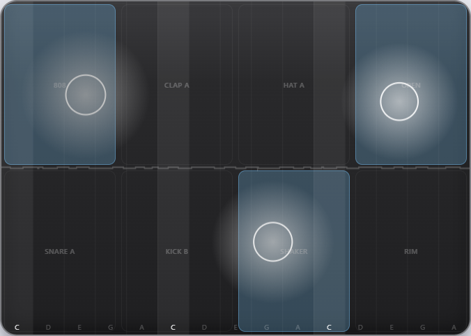<br><b>Drums</b> — a labelled pad kit that also builds the 16‑step beat</td>
  </tr>
</table>

### …and a shark that swims it

A faint ASCII **shark** cruises the play surface and chases your fingers (adapted from the author's
tilde.town `~chumthewaters` page). Flip to **Grid view** and the whole rack plays at once — *all 15
voices on screen in a balanced 5×3, each its own mini Magic Trackpad with its own shark*, lighting up
in its loop's colour.

<table>
  <tr>
    <td width="38%" align="center">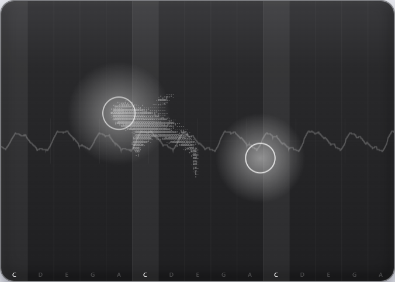<br><sub>The shark, mid‑cruise, visiting your fingers</sub></td>
    <td width="62%" align="center">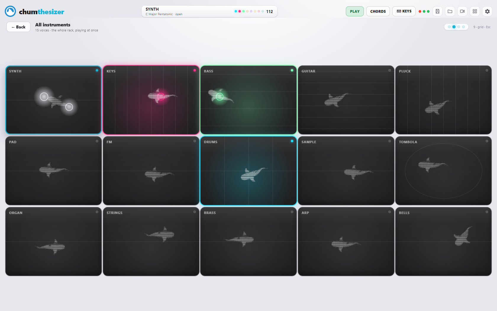<br><sub>Grid view (<code>9</code>) — the whole rack at once · type <code>jaws</code> for a feeding frenzy</sub></td>
  </tr>
</table>

---

## What it is

A pocket‑operator‑style **groovebox** that lives in the browser and treats a Magic Trackpad 2 like a
real instrument. The multitouch surface plays an in‑app Web Audio synth
(X = pitch, finger height = loudness/brightness), backed by a drum machine, a 16‑step sequencer, and an
8‑track **looper** that records, overdubs, mutes, stacks, clones, and plays layers at ½× / 1× / 2× —
all on one drift‑free clock. Switch the surface between **15 voices** live (a 5×3 selector above the
pad); each remembers its own sound. A reactive screen tells you what's going on; a context panel
follows the active instrument; and the three hardware devices map onto it for a tactile, hands‑on jam.

---

## The hardware

Three devices, each doing what its shape is best at. **All three are optional** — the app is fully
playable with a mouse, computer keyboard, or touchscreen, and lights up as you connect each one.

<table>
  <tr>
    <td width="33%" align="center">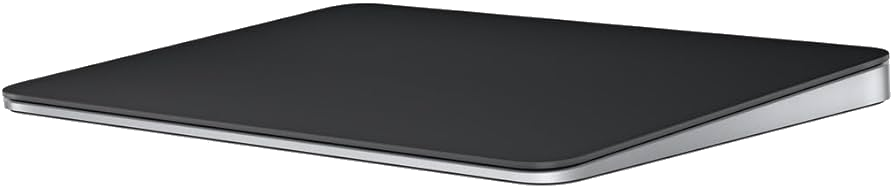<br><b>Apple Magic Trackpad 2</b></td>
    <td width="33%" align="center">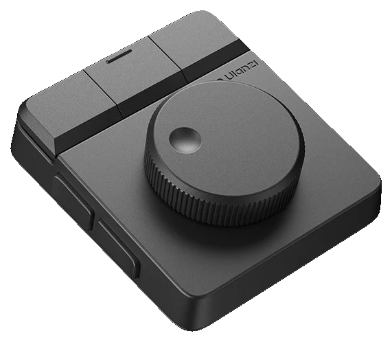<br><b>Ulanzi D100H dial</b></td>
    <td width="33%" align="center">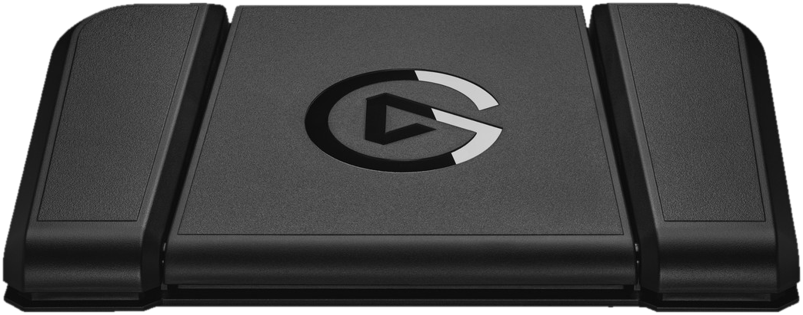<br><b>Elgato Stream Deck Pedal</b></td>
  </tr>
</table>

- **Magic Trackpad 2 — the instrument.** Multitouch. On Windows no driver exposes the trackpad's
  Force‑Touch (and raw HID is OS‑blocked), so a small C# helper (`trackpad-bridge/`) reads finger
  contacts via the Windows Raw Input API and suppresses the OS cursor while you play. There's **no
  per‑finger pressure on Windows**, so **finger height drives dynamics** (top = loud/bright, bottom =
  soft/dark) — plus contact size on the rare trackpad that reports it. Wired USB. (Real Force‑Touch
  pressure is a macOS luxury; see DESIGN.md §1.)
- **Ulanzi D100H dial — the warp.** Turn = the current knob macro (Filter → Bright → Reverb → Mod →
  Noise); press = cycle that macro; the **7 keys are sound presets** — hold one for that sound, hold
  several to *blend* them into a new in‑between voice. It's an **endless encoder**, so the on‑screen
  knob spins freely in both directions — no stop. Bridged into the app via a UlanziDeck plugin
  (`plugins/ulanzi-plugin/`) so all 7 keys work with no system volume/media side effects.

  <p align="center">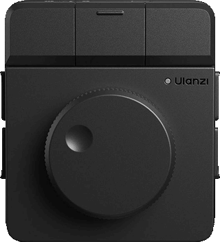</p>

- **Stream Deck Pedal — hands‑free looping.** Left = **Rec** the next layer (auto‑advances, so it
  doubles as "next") · Middle = **Play/Stop** all · Right = **Undo** the last layer. Bridged via a
  Stream Deck plugin (`plugins/streamdeck-plugin/`).

> The deep reverse‑engineering of the D100H (why the plugin bridge is the only clean path to all 7
> keys) lives in the companion repo, **[ulanzi-d100h-homebrew](https://github.com/brendanwelsh/ulanzi-d100h-homebrew)**.

---

## Instruments

Switch from the 5×3 grid above the trackpad, `Tab`/`Shift`+`Tab`, the dial keys, or `F1`–`F9`. Fifteen voices:

| | Voice | What it does |
| --- | --- | --- |
| 🎚 | **Synth** | Continuous pitch **ribbon** — X glides pitch, finger height swells it. The expressive theremin. |
| 🎹 | **Keys** | Struck notes on a real **piano keyboard** overlay. |
| 🎛 | **Organ** | Drawbar columns — thick, sustained. |
| 🌫 | **Pad** | Soft sustained bands — slow attack, long release. |
| 🔔 | **Bells** | Bright struck bells — glassy, high, with a touch of FM shimmer. |
| ✦ | **Pluck** | Short, percussive plucks down narrow key columns. |
| 〰 | **FM** | Metallic FM voice on a faint cross‑lattice. |
| 🎸 | **Bass** | Fat, low ribbon — its preset carries the octave + weight. |
| 🎸 | **Guitar** | Plucky struck voice across **six strings**. |
| 🎻 | **Strings** | Bowed, orchestral lines. |
| 🎺 | **Brass** | Three trumpet valves. |
| ↗ | **Arp** | Hold a chord and it **arpeggiates** in time with the groove; lift fingers to change it. |
| 🥁 | **Drums** | A labelled **pad kit** that also writes the 16‑step beat (`Beat → Loop` bakes the pattern into a layer). |
| ⦿ | **Tombola** | A **physics** sequencer: drop bouncing balls into a spinning arena; each wall hit plucks a note. |
| 🎤 | **Sample** | Record from the mic, then play the clip **pitched** across the pad (the vocal‑chop move). |

---

## Controls

Everything is playable from the keyboard; the three devices mirror it. Press **`/`** in‑app for the
live legend — the full map is in **[KEYBINDS.md](KEYBINDS.md)**.

| Where | Control | Action |
| --- | --- | --- |
| **Trackpad** | finger(s) | Play the active instrument; what you play records into the armed loop |
| **Dial** | turn | The current knob macro: Filter → Bright → Reverb → Mod → Noise |
| **Dial** | press | Cycle the knob macro |
| **Dial** | 7 keys | Sound presets — hold to pick, hold several to **blend** |
| **Pedal** | left / middle / right | **Rec** next layer · **Play/Stop** · **Undo** last layer |
| **Keys** | `A S D F G H J K L ;` · `Q W E R T Y U I O P` | Play scale degrees |
| **Keys** | `1`–`8` | Record → play → mute that loop (and jump to its instrument) · `Shift` = clear |
| **Keys** | `Space` / `Enter` | Play / stop · `` ` `` arm record · `Del` undo last loop |
| **Keys** | `Tab` · `F1`–`F9` | Switch instrument · `[ ]` octave · `, .` scale · `- =` key |
| **Keys** | `X` | **Dice** — re‑roll a musical sound + groove |
| **Keys** | `Z` / `C` · hold `V`/`B`/`N`/`M` + turn dial | Filter sweep · tweak Reverb / Bright / Noise / Mod |
| **Keys** | `9` · `0` · `F10` | Grid view · find‑chords guide · PLAY↔NAV (free the cursor) |
| **Whimsy** | hold `\` · type `jaws` · logo ×5 | Tape‑stop (grind to a halt) · shark frenzy · shark breaks loose |

---

## Run it

```bash
npm install
npm run dev        # Vite dev server → http://127.0.0.1:5173  (Chrome/Edge — WebHID)
npm run app        # build the trackpad helper + dial plugin, build, launch the Electron app (best)
npm run build      # production build → dist/
npm run typecheck  # tsc --noEmit
```

Click once to start audio, then play — mouse, keyboard, or touch. **Electron is the better home for
the trackpad**: it auto‑starts the C# Raw‑Input helper (so the trackpad just works) and disables the
Chromium HID blocklist. Hardware setup (the C# helper, the dial + pedal plugins) is in **[BUILD.md](BUILD.md)**.
Settings + the current pattern persist to `localStorage`.

---

## Layout

```
src/
  instruments/   instrument.ts (contract) · melodic.ts · drumpad.ts · sampler-inst.ts
                 tombola.ts · arp.ts · rack.ts (active instrument + replay routing)
  loop/looper.ts the robust 8-track looper (record · overdub · mute · stack · clone · ½×/1×/2×)
  audio/         engine.ts (master graph + DJ filter) · voice.ts · drums.ts · sequencer.ts
                 sounds.ts · scales.ts · sampler.ts · midi.ts
  input/         pad.ts · trackpad-bridge.ts · dial-bridge.ts · pedal-bridge.ts · dial-map.ts
  ui/            instswitch · overlay · loopdeck · transport · panel · settings · screen
                 dial · pedalview · visualizer · shark · gridview · recorder · legend
  main.ts        wires inputs → rack → looper → engine + the UI
electron/main.cjs  desktop shell (HID blocklist disabled so WebHID can claim the trackpad)
trackpad-bridge/   C# helper — Raw Input multitouch contacts + cursor suppression
plugins/           UlanziDeck plugin (D100H dial + 7 keys) · Stream Deck plugin (foot pedal)
```

More: **[DESIGN.md](DESIGN.md)** (rationale — the trackpad path + the dial decision) · **[BUILD.md](BUILD.md)** (run &
play) · **[KEYBINDS.md](KEYBINDS.md)** (the full key map).

---

## More from the author

Other hardware‑driven projects by [@brendanwelsh](https://github.com/brendanwelsh):

- **[ulanzi-d100h-homebrew](https://github.com/brendanwelsh/ulanzi-d100h-homebrew)** — the companion
  notes: community reverse‑engineering of the **D100H dial** (HID‑level behaviour, how Ulanzi Studio
  stores config, the plugin‑bridge path this project uses), plus a drop‑in on‑screen dial you can
  spin. Start here if you want to drive *your own* software from the dial.
- **[ulanzi-camera-switcher](https://github.com/brendanwelsh/ulanzi-camera-switcher)** — drive a live
  security‑camera viewer from the dial: rotate = next/prev camera, press = open/close a maximized mpv
  viewer, keys jump to a specific feed. Works with any RTSP/HTTP camera; ships as a UlanziDeck plugin
  *and* a standalone HID daemon.
- **[ulanzi-pixel-clock-awtrix](https://github.com/brendanwelsh/ulanzi-pixel-clock-awtrix)** — guide +
  curated resources for the Ulanzi **TC001 Pixel Clock** on AWTRIX firmware: hardware, flashing, the
  MQTT/HTTP API, and Home Assistant integrations.

---

## Credits

- **Shark** ASCII art + swim logic adapted from the author's tilde.town `~chumthewaters` page.
- The **D100H dial photos + GIF** and the interactive dial‑skin assets are shared with
  [ulanzi-d100h-homebrew](https://github.com/brendanwelsh/ulanzi-d100h-homebrew) (they originated here).
- Built with **TypeScript · Vite · Electron · the Web Audio API · [Anime.js](https://animejs.com)**.
  The Magic Trackpad force decode (the macOS/Linux WebHID path in `src/input/trackpad.ts`) follows
  the Linux `hid-magicmouse` driver.

*No affiliation with Apple, Ulanzi, or Elgato; product names and images are for identification only.*
